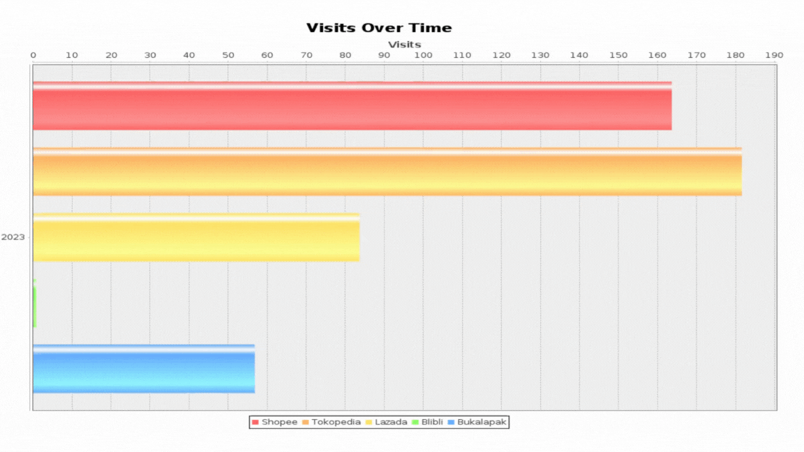

# Visualisasi Data Penjualan E-commerce dengan Grafik Batang Animasi
Mata Kuliah: Komputer Grafik \
Tugas: Proyek Visualisasi Data Penjualan E-commerce

Proyek ini menggambarkan visualisasi dari data kunjungan situs e-commerce terkenal di Indonesia dari tahun 2023. Data ini direpresentasikan dengan menggunakan grafik batang yang memiliki animasi. Setiap bar merepresentasikan sebuah platform e-commerce dan jumlah kunjungannya. Nilai kunjungan berubah-ubah dengan animasi untuk menunjukkan dinamika data yang mungkin terjadi dalam kenyataan.

## Tujuan
- Mempelajari penggunaan pustaka JFreeChart dalam pembuatan grafik di Java.
- Menggabungkan konsep pemrograman berorientasi objek dan grafik untuk menciptakan visualisasi yang interaktif.
- Memahami bagaimana animasi dapat diterapkan pada grafik untuk memberikan representasi dinamik dari data.

## Teknologi yang Digunakan
- Java
- Pustaka JFreeChart untuk visualisasi grafik
- Swing untuk antarmuka grafik pengguna

## Screenshot

## Kesimpulan
Visualisasi data dengan grafik yang animasi memberikan perspektif yang lebih dinamis terhadap data. Dengan teknik ini, kita bisa mendapatkan gambaran lebih baik tentang bagaimana data berubah seiring waktu atau dalam kondisi tertentu.

## Referensi
- [JFreeChart Official Documentation](http://www.jfree.org/jfreechart/)
- [Tugas.pdf](assets/tugas.pdf)